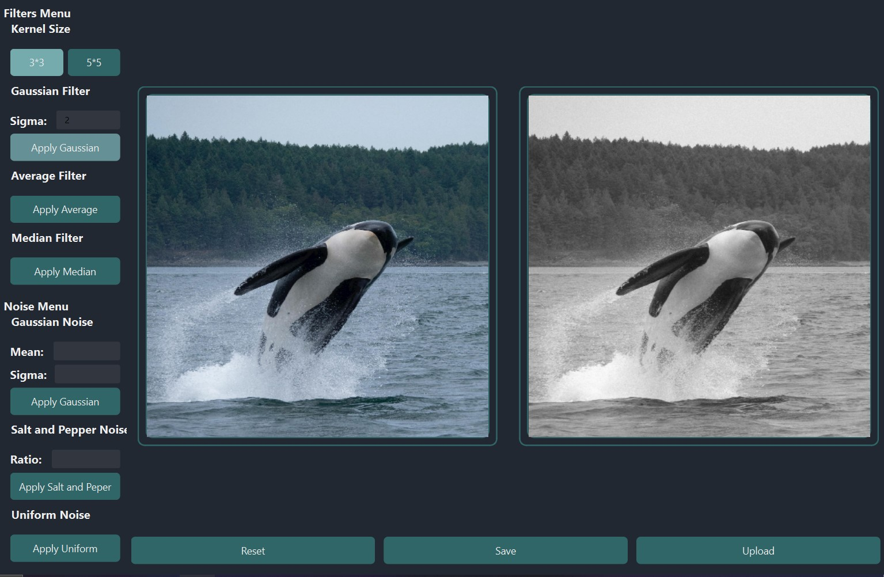
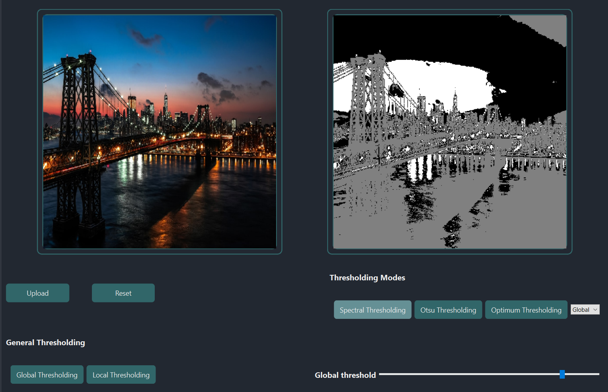

# VisionX: Advanced Image Processing Toolbox

VisionX is a niche desktop application crafted in C++ utilizing the Qt framework. It offers a variety of options for manipulating images,with an easy to use interface, including noise addition, filtering, edge detection, histogram analysis, image equalization and normalization, thresholding, frequency domain filters, and the creation of hybrid images making it suitable for a wide range of applications, including image processing, object detection,image features extraction, and more.

## Table of contents:

- [Project Features](#project-features)
- [Project Structure Overview](#project-structure-overview)
- [How to Run The Project](#how-to-run-the-project)
- [Download Demo](#download-demo)
- [Contributors](#contributors)

### Project Features:

1. Filters, Noise and Edge Detectors tab:<br />
   Includes 3 types of noise that the user can add to grey/coloured images:

   |         Uniform Noise          |         Guassian Noise          |        Salt & Pepper Noise         |
   | :----------------------------: | :-----------------------------: | :--------------------------------: |
   |  |  |  |

   Includes 4 edge detector types with the ability to control any additional option for detector:
   | Sobel | Roberts | Perwitt | Canny |
   | :----------------------------: | :-----------------------------: | :--------------------------------: | :--------------------------------: |
   |  |  |  |  |

   Includes 3 types of filter enabling user to control kernel size:

   |         Average Filter          |         Gaussian Filter          |         Median Filter          |
   | :-----------------------------: | :------------------------------: | :----------------------------: |
   |  |  |  |

   for more details about this tab and results check [Report 1](docs/Computer%20Vision%20Task%201%20Report%20%20.pdf)

2. Normalization, Equalization and Thresholding tab:<br />
   Shows images histogram with options to normalize or equalize:
   | Histogram | Normalization | Equalization |  
   | :----------------------------: | :-----------------------------: | :-----------------------------: |
   |  |  |  |

   Apply both global or local thresholding on uploaded image:
   | Local | Global |  
   | :----------------------------: | :-----------------------------: |
   |  |  |

   for more details about this tab and results check [Report 1](docs/Computer%20Vision%20Task%201%20Report%20%20.pdf)

3. Frequency Domain Filters and Hybrid Image tab:
   User can upload an image and determine the radius for each filter type(high pass or low pass)
   | High pass | Low pass |  
   | :----------------------------: | :-----------------------------: |
   |  |  |

   for more details about this tab and results check [Report 1](docs/Computer%20Vision%20Task%201%20Report%20%20.pdf)

4. Hough Transform tab:
   This tab enbles users to apply Line/ Circle / Ellipse hough transform:
   | Line | Circle | Ellipse |  
   | :----------------------------: | :-----------------------------: | :-----------------------------: |
   |  |  |  |

   for more details about this tab and results check [Report 2](docs/Computer%20Vision%20Task%202%20Report%20%20.pdf)

5. Active Contour tab:
   User has the ability to select cirlce from image and tune parameters to contour objects.
   | Example 1 | Example 2 |  
   | :----------------------------: | :-----------------------------: |
   |  |  |

   for more details about this tab and results check [Report 2](docs/Computer%20Vision%20Task%202%20Report%20%20.pdf)

6. Harris and Lambda Corner detector tab:
   User can detect corners by Harris or lambda methods and change kernel size and threshold.
   | Harris | Lambda |  
   | :----------------------------: | :-----------------------------: |
   |  |  |

   for more details about this tab and results check [Report 3](docs/Computer%20Vision%20Task%203%20Report%20%20.pdf)

7. Image Matching Methods tab:
   User can match the image template and full image with 2 methods:
   | Square Sum of Differences method | Cross-Correlation Method |  
   | :----------------------------: | :-----------------------------: |
   |  |  |

   for more details about this tab and results check [Report 3](docs/Computer%20Vision%20Task%203%20Report%20%20.pdf)

8. Sift Descriptors tab:
   User can upload one or two images to get SIFT Keypoints with options to tune, and then compute keypoints matching between images.
   <p align="center">
     
   </p>

   for more details about this tab and results check [Report 3](docs/Computer%20Vision%20Task%203%20Report%20%20.pdf)

9. Advanced Thresholding tab:
   Includes Global Thresholding with 2 methods:
   |Ostu Thresholding| Optimal Thresholding |  
   | :----------------------------: | :-----------------------------: |
   |  |  |

   Includes Local Multi-level Thresholding and Global Multi-level Thresholding:
   |Local Multi-level Thresholding| Global Multi-level Thresholding |  
   | :----------------------------: | :-----------------------------: |
   |  |  |

   for more details about this tab and results check [Report 4](docs/Computer%20Vision%20Task%204%20Report%20%20.pdf)

10. Segmentation Methods tab:
    User can segment RGB images with 4 types of segmentation:
    | K-Means Segmentation | Mean Shift Segmentation |
    | :----------------------------: | :-----------------------------: |
    |  |  |

    | Agglomerative Segmentation |         Region Growing          |
    | :------------------------: | :-----------------------------: |
    |    |  |

for more details about this tab and results check [Report 4](docs/Computer%20Vision%20Task%204%20Report%20%20.pdf)

### Project Structure Overview:

```
main
├─ Models : header/source files related to CV algorithms implementation.
├─ docs : reports related to results and theory behind.
├─ Gallery : images used for testing.
├─ Controllers: Contains the controllers responsible for handling communication between models and views.
├─ UI : include ui/header / resource file related to pages design.
└─ Helpers: used for common app logic and different ui functionality.
```

### Getting Started

### Dependenices

    - Qt Version 6.4.2
    - OpenCV 4.9.0

### Installation

1. Ensure Qt is installed on your system.
2. Clone the VisionX repository to your local machine.

### How to run the project

- Download and Install Qt from the online installer using minGW 64 architecture.

```
www.qt.io
```

- Download and build openCV 4.9.0 from their website

```
www.opencv.org/releases/
```

- if you don't know how to build OpenCV on your PC please refer to the installCV.md

- Go to the Task1.pro file and ensure that openCV libraries are referred to in your pc like that.

Windows

```
INCLUDEPATH += <yourCV build folder path>\install\include

LIBS += -L<yourCV build folder path>\release\lib \
    -lopencv_calib3d490                 \
    -lopencv_core490                    \
    -lopencv_features2d490              \
    -lopencv_flann490                   \
    -lopencv_highgui490                 \
    -lopencv_imgproc490                 \
    -lopencv_imgcodecs490               \
    -lopencv_photo490                   \
    -lopencv_stitching490               \
    -lopencv_ts490                      \
    -lopencv_video490                   \
    -lopencv_videoio490                 \
    -lopencv_objdetect490               \
```

Linux

```
CONFIG += link_pkgconfig
PKGCONFIG += opencv4
```

### Building

1. Open the project in Qt Creator.
2. Make sure your .pro file matches commonpro.txt file
3. Build the project to generate the executable.

### Usage

1. Launch the application.
2. Open an image file.
3. Select desired operations from the menu.
4. Adjust parameters as needed.
5. View & analyze the processed image.

### Download Demo

### Contributors

<table>
  <tr>
      <td align="center">
    <a href="https://github.com/abduelrahmanemad" target="_black">
    
    <br />
    <sub><b>Abdulrahman Emad</b></sub></a>
    </td>
    <td align="center">
    <a href="https://github.com/mouradmagdy" target="_black">
    
    <br />
    <sub><b>Mourad Magdy</b></sub></a>
    <td align="center">
    <a href="https://github.com/ZiadMeligy" target="_black">
    
    <br />
    <sub><b>Ziad Meligy</b></sub></a>
    </td>
    </td>
    <td align="center">
    <a href="https://github.com/Maskuerade" target="_black">
    
    <br />
    <sub><b>Mariam Ahmed</b></sub></a>
    </td>
     <td align="center">
    <a href="https://github.com/Youssef-Ashraf71" target="_black">
    
    <br />
    <sub><b>Youssef Ashraf</b></sub></a>
    </td>
      </tr>
 </table>
